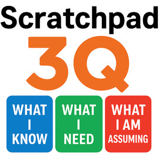

<!-- $ convert logo_large.png -resize 270x270 project_logo.jpg -->

# Scratchpad 3Q Reasoning: Surfacing Assumptions to Mitigate Hallucination and Improve Truthfulness in Large Language Models

[]()
[]()
[]()
[](./LICENSE.md)

A lightweight prompt-level framework that asks an LLM to produce a short, delimited scratchpad alongside a single concise final answer. The scratchpad exposes three short sections (What I Know, What I Need, What I Am Assuming) to make model reasoning auditable and to reduce hallucination in user-visible responses. The project includes a small reference prompt parser (`utils/scratchpad.py`), caching utilities, an optional local model server, and an evaluation harness using TruthfulQA.

## Highlights

- Prompt-level intervention (no model retraining required).
- Produces a machine-parseable scratchpad and a final answer separated by explicit markers.
- Logs scratchpads for audit, analysis, and downstream hallucination detection research.
- Includes example integration with an evaluation harness (TruthfulQA).

## Requirements

The project uses Python and depends on a few packages. Exact requirements depend on your chosen execution mode (OpenAI API vs. local model server).

Typical dependencies (install into a virtualenv):

```bash
pip install -r requirements.txt
```


## Setup

1. Create and activate a Python virtual environment.
2. Install the dependencies listed above.
3. Set environment variables:

- For OpenAI API usage (default mode):

```bash
export OPENAI_MODEL="gpt-4"  # or whichever model name you want to use
export OPENAI_API_KEY="sk-..."  # set your OpenAI API key in env
```


## Usage examples

### 1) Use the scratchpad prompt wrapper (OpenAI API mode)

Example (Python):

```python
from utils.scratchpad import get_scratchpad_response

query = "Is it possible for water to flow uphill?"
final = get_scratchpad_response(query, max_tokens=200, temperature=0.0)
print("Final answer:\n", final)
```

If you prefer to access the full parsed scratchpad, you can call `wrap_with_scratchpad_instruction()` and `parse_scratchpad_response()` directly (see `utils/scratchpad.py`).


### 2) Running TruthfulQA evaluation

`utils/eval_TruthfulQA.py` provides a small harness that evaluates the model with and without the scratchpad. It uses a custom `CustomModel` wrapper which calls `get_response()` or `get_scratchpad_response()` depending on the `scratchpad` flag.

Run the evaluation (requires `deepeval` and the TruthfulQA dataset available via that package):

```bash
python utils/eval_TruthfulQA.py
```

The script will print standard and scratchpad evaluation results and per-task scores.

